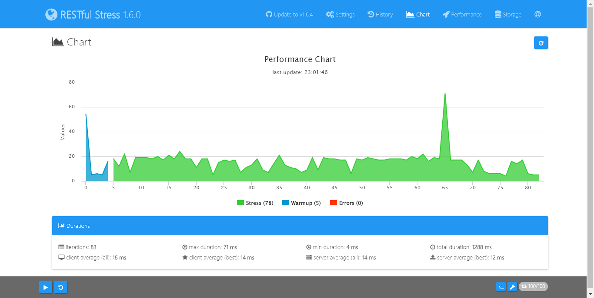

#app-ventas-service

<a title="GitHub" href="https://github.com/caguzmansoto/app-ventas-service"></a>
# Descripción y contexto

- El microservicio tiene como objetivo implementar un sistema Back-End de ventas.

# Estado del Proyecto

- Estado: En desarrollo
- Versión: 0.0.1

# Requisitos del Entorno de Desarrollo

 - Para ambientar un equipo y comenzar a desarrollar sobre el microservicio app-ventas-service, es necesario contar con las siguientes herramientas y tecnologías:

1. Java 8
2. Maven version 3.6.X.
3. Git para el control de versiones

# Guía de Funcionamiento

 - Para poder levantar el servicio localmente se deben seguir los siguientes pasos:


1. Clonar repositorio usando URL

   ```bash
    git clone https://github.com/caguzmansoto/app-ventas-service.git
   ```

2. Instalar dependencias de microservicio

   ```bash
   cd app-ventas-service
   ```
   
      ```bash
   mvn clean compile -U
   ```

3. Ejecutar con el IDE de preferencia.
4. Importar colección postman.
   ```
    Ruta: docs/coleccion-postman/app-ventas-service.postman_collection.json
   ```

5. Ejecutar endpoint de preferencia usando Postman. Por ejemplo:

   ```
    GET http://localhost:8080/presentaciones
   ```


#### URL Swagger en ambiente desarrollo

- http://localhost:8080/swagger-ui.html

# Bug Conocidos o Probables
 - Ninguno


# RESTfull stress API

 - Categoría


- Presentacion




# Servicios externos consumidos
 - Ninguno   
 
# Base de Datos 
   - Motor: PostgreSQL
   - BBDD: guzmans_ventas
   - Usuario/Esquema: postgres
   - Contraseña: admin
   - URL: jdbc:postgresql://localhost/guzmans_ventas
   - Host: localhost
   - Puerto: 5432  

# Modelos BBDD


#Autor
 Carlos Guzmán

